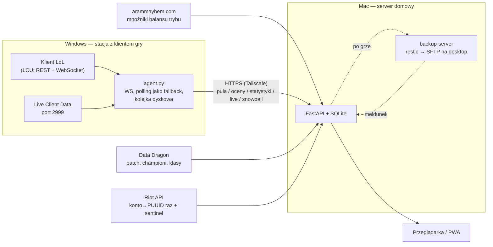

# Mastery Tracker

Osobiste narzędzie do śledzenia sezonowej maestrii championów w League of
Legends. Odpowiada na jedno pytanie: którym championem zagrać teraz, żeby
najszybciej dowieźć milestone 4.

Jedno konto, sieć prywatna, bez monetyzacji.

## Problem

Klient gry pokazuje bieżący stan maestrii, ale nie pokazuje zmian między
sesjami i nie porównuje championów pod kątem pracy pozostałej do kolejnego
milestone'a. Przy misjach z przepustki ręczne sprawdzanie całego poolu nie ma
sensu. W ARAM-ie pula jest dodatkowo losowa — decyzja zapada w kilka sekund
spośród kilkunastu postaci, które akurat wypadły.

## Architektura



Agent słucha zdarzeń klienta po WebSockecie (fazy gry, champ select, ocena
pomeczowa), z pollingiem co 10 s jako siatką. Wysyła wszystko na serwer przez
Tailscale: pulę z oznaczeniem picków wymagających wymiany, oceny, ekran
końcowy, log zdarzeń live (eventdata), stan przepustek z event-hubu i misje
maestrii. Serwer trzyma dane w SQLite i liczy ranking. Jedyna stała zależność
zewnętrzna to Data Dragon; Riot API służy do jednorazowego mapowania konta na
PUUID, do sentinela sprawdzającego raz dziennie, czy Riot otworzył Mayhema
w match-v5 — oraz do dobowej pętli snapshotów maestrii, dzięki której dni bez
włączonego Windowsa nie są ślepe (publiczne champion-mastery-v4 wystarcza do
milestone'ów, choć nie przypisze ocen do meczów).

## Skąd dane o grach

Publiczne match-v5 nie zwraca gier ARAM Mayhem (kolejka 2400). To celowa,
globalna polityka Riota dla tego trybu, nie właściwość konta — zwykły ARAM
wraca normalnie. Jedynym źródłem Mayhema jest lokalne API klienta (LCU).

Listing historii w LCU to kroczące okno 20 ostatnich gier. Parametry
begIndex/endIndex są ignorowane na obu wariantach endpointu (sprawdzone sondą:
alias current-summoner i wariant po PUUID, indeksy do 99). Starszych gier nie
da się wylistować — ale pojedynczą grę można pobrać po ID w komplecie
(`/lol-match-history/v1/games/{gameId}`), dowolnie starą. Statystyki są więc
odzyskiwalne, o ile ID gry zostało kiedykolwiek zapisane — i agent robi to
sam: backend zna gry z ekranów końcowych, ocen i domkniętych pul
(`/api/history/missing`), a agent przy bezczynnym kliencie dociąga brakujące
pojedynczo po ID, przycięte do własnego uczestnika.

Bezpowrotnie ginie tylko ocena pomeczowa: `champion-mastery-updates` istnieje
wyłącznie w trakcie ekranu końcowego. Dlatego agent musi działać przy każdej
sesji grania.

Drugą daną ulotną jest log zdarzeń Live Client (kille, zgony, wieże
z timestampami): żyje razem z portem 2999 i znika z nim. Agent zapamiętuje
ostatni stan `events` z allgamedata (które i tak odpytuje) i po grze odkłada
go do `live_event_log` — surowiec pod przyszłe metryki timingu. Z ekranu
końcowego trafiają do bazy także itemy (`item0..item6`) i augmenty
(`playerAugment1..6`); snowball zbiera itemy od pierwszego dnia, bo historia
LCU trzyma je płasko w statystykach.

Z bloku końcowego zapisywane są też tożsamości wszystkich dziesięciu graczy
(`match_participant`: mecz → PUUID per slot, ta sama numeracja co
w statystykach) — spłaszczanie odrzuca pola nienumeryczne, więc bez osobnej
tabeli łącze ginęło. Surowe bloki ocen (`champion-mastery-updates`) są
archiwizowane w całości w `grade_raw` (wzorzec `eog_raw`): zapis wyciąga
kilkanaście pól, a resztę trzyma skompresowany blob — ubezpieczenie na
wypadek, gdyby Riot przebudował system ocen.

## Drabinka milestone'ów

Progi nie są udokumentowane w API — aplikacja odczytuje je z pola
`nextSeasonMilestone` championów stojących na różnych szczeblach.

| Krok | Wymóg | Nagroda |
|---|---|---|
| 0 → 1 | A- ×1 | 1 Mark |
| 1 → 2 | A- ×1 | 1 Mark |
| 2 → 3 | S- ×1 | 2 Marks |
| 3 → 4 | S- ×1 | 2 Marks + Crest Highlighting |

## Ocena pomeczowa

Dwa kanały: zdarzenie WebSocket `champion-mastery-updates` w momencie
powstania oceny oraz pętla dopytująca (co 2 s, do 120 s) jako siatka
bezpieczeństwa. Z logów produkcyjnych: okno otwiera się na fazie
PreEndOfGame, 4–6 s po końcu gry — pojedynczy odczyt zawsze przegrywał
ten wyścig.

## Model

Regresja porządkowa (proportional odds) z cenzurowaniem, czysty Python:

    P(ocena ≥ k | x) = sigmoid(β·x − α_k),   α rosnące po drabince ocen

Jeden wspólny wektor wag β, osobny próg α na szczebel. Ocena dokładna („B+")
wnosi do wiarygodności swoją komórkę, cenzurowana („≥A-" z awansu milestone'a,
przy którym tablica ocen się zeruje) — cały ogon. Dzięki temu próg S- uczy się
na pełnej próbce, a P(≥A-) ≥ P(≥S-) zachodzi z konstrukcji.

Cechy: gold/min, (K+A)/min, zgony/min, znormalizowane obrażenia, długość gry.
λ regularyzacji wybierana przez leave-one-out; walidacja LOO per próg
raportuje trafność i AUC z SE i CI95 (Hanley–McNeil). Próg z mniej niż
5 obserwacjami którejś klasy jest oznaczany jako niewiarygodny, a jego
predykcje nie wchodzą do scorecardu.

Marker gotowości: `GET /api/model/readiness`.

Model porządkowy oddaje wyjaśnienia za darmo: klik w wiersz w Ocenach rozbija
predykcję na wkłady cech (waga × z-score, znak = kierunek ciągnięcia) dla obu
progów i dokłada percentyl obrażeń/min na tle wszystkich zaobserwowanych gier
tym championem, z drabinką zakresu champion → klasa → global
(`GET /api/grades/explain`).

### Projekcja misji

Kafelek przepustek nie pokazuje dolnej granicy (E gier lidera rankingu), tylko
wynik symulacji: 300 przebiegów misji z losowaniem puli w każdej grze
(rozmiar puli to mediana finalnych pul z własnej bazy, nie stała), wybór
najlepszego z puli wg E(c), rzut na p szczebla. Wynik — mediana i kwartyle
liczby gier — liczy się w tle po każdym treningu modelu. Zegarem misji jest
event sezonowy z event-hubu („Season: Act"); przepustki trybu bywają
przedłużane i nie kończą misji. Gdy tempo z 7 dni nie domyka deadline'u,
kafelek przełącza się w reżim wariancji.

### Dlaczego obrażenia są normalizowane przez championa

Z danych: oceny B+ mają niższe obrażenia na minutę niż C, bo B+ padały na
postaciach utility, a C na Viktorze z 48 tysiącami obrażeń. Ocena jest liczona
względem innych grających tą samą postacią. gold/min rośnie monotonicznie
z oceną (837 → 869 → 892 → 908 → 964 → 1040) i normalizacji nie wymaga.

## Mnożniki balansu trybu

Mayhem ma odrębny od zwykłego ARAM-a balans per champion (Damage Dealt,
Damage Received, Healing, Ability Haste…), zmieniany z patchami. Wiki
tabelaryzuje tylko zwykły ARAM; jedynym znalezionym źródłem prowadzącym
balans tego trybu jest arammayhem.com — backend parsuje stronę zbiorczą
raz na dobę (bramka jakości: podejrzanie mały wynik nie nadpisuje ostatnich
dobrych danych), a UI pokazuje mnożniki przy hero i w panelu live.
Decyzja graniczna: to źródło służy **wyłącznie do wyświetlania** — nigdy
jako cecha modelu ani normalizator. Obok, przy nazwie championa, link
„notki" prowadzi do sekcji championa w notkach patcha na wiki (numeracja
marketingowa = wewnętrzna + 10 na majorze, od rebrandu 2025).

## Normy: snowball

Serwisy statystyczne jawnie nie mają Mayhema, więc normy per champion są
budowane z dwóch własnych źródeł:

- ekran końcowy każdej gry: 183 pola statystyk × 10 graczy, czyli
  10 obserwacji o Mayhemie na mecz — także o championach, którymi się nie gra,
- snowball: z każdego meczu agent zna PUUID-y 9 pozostałych graczy;
  przy bezczynnym kliencie dociąga ich historie przez LCU (1 gracz na minutę,
  okno rewizyty 7 dni, dedup po game_id, własne gry odfiltrowane).
  Priorytet kolejki mają gracze widziani w wielu własnych meczach
  (`match_participant`) — ich historie najszybciej karmią normy.

`champion_norms` liczy μ i σ per champion ze ściąganiem champion → klasa
(tagi Data Dragona) → global, proporcjonalnie do liczby obserwacji. Panel live
porównuje bieżące tempo z medianą własnych gier ≥ progu, w drabince zakresu:
ten champion (≥3 trafienia) → jego klasa (≥3) → wszystkie gry.

Snowball służy też jako proxy populacji: walidacja retrospektywna (ρ = −0.58
między popularnością championa a resztami modelu) potwierdziła, że rzadko
grane championy mają realnie łagodniejszy próg oceny — pula w champ selekcie
oznacza je plakietką „słaba populacja". Obok: „wymiana" przy pickach kolegów
i „ZBADAJ" przy championach z mniej niż trzema własnymi grami (gra ma też
wartość informacyjną dla modelu). Nad rankingiem świeci baner patchowy, dopóki
model liczy się głównie na poprzednim patchu — w Mayhemie patch zmienia także
mnożniki balansu trybu, odrębne od zwykłego ARAM-a.

## Stack

- Backend: Python 3.12, FastAPI, SQLite (domyślny journal — WAL nie działa na bind moncie virtiofs)
- Frontend: HTML + app.js + style.css, bez frameworka i bez builda
- Agent: Python 3.11+ (aiohttp), WebSocket LCU z pollingiem jako fallbackiem, kolejka dyskowa
- Dostęp: Tailscale (serve, tylko tailnet) z certyfikatami HTTPS
- Uruchomienie: Docker Compose; kontener bez roota (cap_drop ALL, no-new-privileges)
- Higiena: 90+ testów (backend, harness logiki agenta bez LCU, smoke UI
  w Playwright na prawdziwym uvicornie) + CI (ruff, pytest), Dependabot
- Obserwowalność: zakładka System pokazuje liczniki bramek danych, zdrowie
  potoku (oceny-sieroty, gry bez statystyk itd.) i wynik ostatniego backupu
  (backup-server melduje go na `/api/backup/report`; token przez env
  `MASTERY_API_TOKEN`); jest też konsola LCU — surowe GET-y do klienta
  wykonywane przez agenta, sondy bez PowerShella

## Źródła danych

| Źródło | Do czego |
|---|---|
| LCU WebSocket | fazy gry, champ select na żywo, ocena pomeczowa zdarzeniem |
| LCU `/lol-champ-select` | pula championów: ławka + drużyna (wymiana działa, cudzy pick to legalny cel) |
| LCU `/lol-match-history` | historia meczów (okno 20), w tym Mayhem; pojedyncze gry po ID |
| LCU `/lol-end-of-game/champion-mastery-updates` | ocena pomeczowa, punkty |
| LCU `/lol-end-of-game/eog-stats-block` | 183 pola statystyk 10 graczy, augmenty |
| Live Client Data (port 2999) | panel live; API nie oddaje obrażeń, złoto szacowane z ubytków stanu |
| Data Dragon | patch, nazwy, ikony i klasy championów |
| `ACCOUNT-V1` | Riot ID → PUUID, raz |
| `MATCH-V5` | historia spoza Mayhema + sentinel (czy kolejka 2400 już otwarta) |
| arammayhem.com | mnożniki balansu Mayhema per champion — wyłącznie wyświetlanie |

## Uruchomienie

### Serwer

```bash
cp .env.example .env      # uzupełnij klucz i Riot ID
docker compose up -d --build
curl -s localhost:8000/api/health
```

### Agent

Zobacz [`agent/README.md`](agent/README.md).

## Ograniczenia

Personal API Key: 20 zapytań/s i 100 na 2 minuty — aplikacja cache'uje
(mecze są niezmienne, raz pobrane nie są odpytywane ponownie) i pilnuje
limitów po swojej stronie. LCU jest nieoficjalne i może się zmienić bez
ostrzeżenia w dowolnym patchu.

## Status

W codziennym użyciu. Snapshoty przed i po grze plus dobowy cron bez klienta,
oceny dwoma kanałami (surowce archiwizowane w `grade_raw`), pełny ekran
końcowy z itemami, augmentami i tożsamościami graczy (`match_participant`),
log zdarzeń live, snowball z priorytetem znajomych PUUID-ów, odzysk gier
przeoczonych przez okno historii, predykcje zapisywane przed grą (Brier
w `/api/predictions/scorecard`), model porządkowy z walidacją LOO i kartą
wyjaśnień, projekcja misji z symulacji, kafelek przepustek i misji
z event-hubu, mnożniki balansu trybu przy hero i w panelu live, linki do
notek patcha, podsumowanie splitu, panel live, kolejka dyskowa w agencie
(odporna na odrzuty i kolizje), konsola LCU i liczniki bramek w Systemie,
backup restic z tygodniową retencją, weryfikacją i meldunkiem wyniku,
testy + CI + Dependabot.

## Credits

specjalne pozdrowienia dla bezrobotnego menczennika co utknął w dev hellu
swojej gierki, trzymaj się w tym starym obozie

## Disclaimer

Mastery Tracker isn't endorsed by Riot Games and doesn't reflect the views or
opinions of Riot Games or anyone officially involved in producing or managing
Riot Games properties. Riot Games and all associated properties are trademarks
or registered trademarks of Riot Games, Inc.

Projekt niekomercyjny, do użytku własnego. Korzysta z Riot API, lokalnego
API klienta (LCU) oraz Live Client Data API zgodnie z polityką Riot Games
dla aplikacji third-party.
