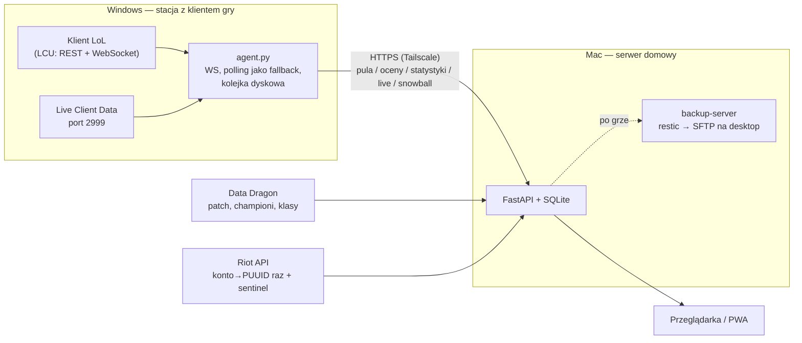

# Mastery Tracker

Osobiste narzędzie do śledzenia sezonowej maestrii championów w League of
Legends. Odpowiada na jedno pytanie: którym championem zagrać teraz, żeby
najszybciej dowieźć milestone 4.

Jedno konto, sieć prywatna, bez monetyzacji.

## Problem

Klient gry pokazuje bieżący stan maestrii, ale nie pokazuje zmian między
sesjami i nie porównuje championów pod kątem pracy pozostałej do kolejnego
milestone'a. Przy misjach z przepustki ręczne sprawdzanie całego poolu nie ma
sensu. W ARAM-ie pula jest dodatkowo losowa — decyzja zapada w kilka sekund
spośród kilkunastu postaci, które akurat wypadły.

## Architektura



Agent słucha zdarzeń klienta po WebSockecie (fazy gry, champ select, ocena
pomeczowa), z pollingiem co 10 s jako siatką. Wysyła wszystko na serwer przez
Tailscale. Serwer trzyma dane w SQLite i liczy ranking. Jedyna stała zależność
zewnętrzna to Data Dragon; Riot API służy do jednorazowego mapowania konta na
PUUID oraz do sentinela sprawdzającego raz dziennie, czy Riot otworzył Mayhema
w match-v5.

## Skąd dane o grach

Publiczne match-v5 nie zwraca gier ARAM Mayhem (kolejka 2400). To celowa,
globalna polityka Riota dla tego trybu, nie właściwość konta — zwykły ARAM
wraca normalnie. Jedynym źródłem Mayhema jest lokalne API klienta (LCU).

Listing historii w LCU to kroczące okno 20 ostatnich gier. Parametry
begIndex/endIndex są ignorowane na obu wariantach endpointu (sprawdzone sondą:
alias current-summoner i wariant po PUUID, indeksy do 99). Starszych gier nie
da się wylistować — ale pojedynczą grę można pobrać po ID w komplecie
(`/lol-match-history/v1/games/{gameId}`), dowolnie starą. Statystyki są więc
odzyskiwalne, o ile ID gry zostało kiedykolwiek zapisane.

Bezpowrotnie ginie tylko ocena pomeczowa: `champion-mastery-updates` istnieje
wyłącznie w trakcie ekranu końcowego. Dlatego agent musi działać przy każdej
sesji grania.

## Drabinka milestone'ów

Progi nie są udokumentowane w API — aplikacja odczytuje je z pola
`nextSeasonMilestone` championów stojących na różnych szczeblach.

| Krok | Wymóg | Nagroda |
|---|---|---|
| 0 → 1 | A- ×1 | 1 Mark |
| 1 → 2 | A- ×1 | 1 Mark |
| 2 → 3 | S- ×1 | 2 Marks |
| 3 → 4 | S- ×1 | 2 Marks + Crest Highlighting |

## Ocena pomeczowa

Dwa kanały: zdarzenie WebSocket `champion-mastery-updates` w momencie
powstania oceny oraz pętla dopytująca (co 2 s, do 120 s) jako siatka
bezpieczeństwa. Z logów produkcyjnych: okno otwiera się na fazie
PreEndOfGame, 4–6 s po końcu gry — pojedynczy odczyt zawsze przegrywał
ten wyścig.

## Model

Regresja porządkowa (proportional odds) z cenzurowaniem, czysty Python:

    P(ocena ≥ k | x) = sigmoid(β·x − α_k),   α rosnące po drabince ocen

Jeden wspólny wektor wag β, osobny próg α na szczebel. Ocena dokładna („B+")
wnosi do wiarygodności swoją komórkę, cenzurowana („≥A-" z awansu milestone'a,
przy którym tablica ocen się zeruje) — cały ogon. Dzięki temu próg S- uczy się
na pełnej próbce, a P(≥A-) ≥ P(≥S-) zachodzi z konstrukcji.

Cechy: gold/min, (K+A)/min, zgony/min, znormalizowane obrażenia, długość gry.
λ regularyzacji wybierana przez leave-one-out; walidacja LOO per próg
raportuje trafność i AUC z SE i CI95 (Hanley–McNeil). Próg z mniej niż
5 obserwacjami którejś klasy jest oznaczany jako niewiarygodny, a jego
predykcje nie wchodzą do scorecardu.

Marker gotowości: `GET /api/model/readiness`.

### Dlaczego obrażenia są normalizowane przez championa

Z danych: oceny B+ mają niższe obrażenia na minutę niż C, bo B+ padały na
postaciach utility, a C na Viktorze z 48 tysiącami obrażeń. Ocena jest liczona
względem innych grających tą samą postacią. gold/min rośnie monotonicznie
z oceną (837 → 869 → 892 → 908 → 964 → 1040) i normalizacji nie wymaga.

## Normy: snowball

Serwisy statystyczne jawnie nie mają Mayhema, więc normy per champion są
budowane z dwóch własnych źródeł:

- ekran końcowy każdej gry: 183 pola statystyk × 10 graczy, czyli
  10 obserwacji o Mayhemie na mecz — także o championach, którymi się nie gra,
- snowball: z każdego meczu agent zna PUUID-y 9 pozostałych graczy;
  przy bezczynnym kliencie dociąga ich historie przez LCU (1 gracz na minutę,
  okno rewizyty 7 dni, dedup po game_id, własne gry odfiltrowane).

`champion_norms` liczy μ i σ per champion ze ściąganiem champion → klasa
(tagi Data Dragona) → global, proporcjonalnie do liczby obserwacji. Panel live
porównuje bieżące tempo z medianą własnych gier ≥ progu, w drabince zakresu:
ten champion (≥3 trafienia) → jego klasa (≥3) → wszystkie gry.

## Stack

- Backend: Python 3.12, FastAPI, SQLite (domyślny journal — WAL nie działa na bind moncie virtiofs)
- Frontend: HTML + app.js + style.css, bez frameworka i bez builda
- Agent: Python 3.11+ (aiohttp), WebSocket LCU z pollingiem jako fallbackiem, kolejka dyskowa
- Dostęp: Tailscale (serve, tylko tailnet) z certyfikatami HTTPS
- Uruchomienie: Docker Compose; kontener bez roota (cap_drop ALL, no-new-privileges)
- Higiena: testy + CI (ruff, pytest), Dependabot

## Źródła danych

| Źródło | Do czego |
|---|---|
| LCU WebSocket | fazy gry, champ select na żywo, ocena pomeczowa zdarzeniem |
| LCU `/lol-champ-select` | pula championów: ławka + drużyna (wymiana działa, cudzy pick to legalny cel) |
| LCU `/lol-match-history` | historia meczów (okno 20), w tym Mayhem; pojedyncze gry po ID |
| LCU `/lol-end-of-game/champion-mastery-updates` | ocena pomeczowa, punkty |
| LCU `/lol-end-of-game/eog-stats-block` | 183 pola statystyk 10 graczy, augmenty |
| Live Client Data (port 2999) | panel live; API nie oddaje obrażeń, złoto szacowane z ubytków stanu |
| Data Dragon | patch, nazwy, ikony i klasy championów |
| `ACCOUNT-V1` | Riot ID → PUUID, raz |
| `MATCH-V5` | historia spoza Mayhema + sentinel (czy kolejka 2400 już otwarta) |

## Uruchomienie

### Serwer

```bash
cp .env.example .env      # uzupełnij klucz i Riot ID
docker compose up -d --build
curl -s localhost:8000/api/health
```

### Agent

Zobacz [`agent/README.md`](agent/README.md).

## Ograniczenia

Personal API Key: 20 zapytań/s i 100 na 2 minuty — aplikacja cache'uje
(mecze są niezmienne, raz pobrane nie są odpytywane ponownie) i pilnuje
limitów po swojej stronie. LCU jest nieoficjalne i może się zmienić bez
ostrzeżenia w dowolnym patchu.

## Status

W codziennym użyciu. Snapshoty przed i po grze, oceny dwoma kanałami, pełny
ekran końcowy, snowball, predykcje zapisywane przed grą (Brier
w `/api/predictions/scorecard`), model porządkowy z walidacją LOO, panel live,
kolejka dyskowa w agencie, backup restic z tygodniową retencją i weryfikacją,
testy + CI + Dependabot.

## Disclaimer

Mastery Tracker isn't endorsed by Riot Games and doesn't reflect the views or
opinions of Riot Games or anyone officially involved in producing or managing
Riot Games properties. Riot Games and all associated properties are trademarks
or registered trademarks of Riot Games, Inc.

Projekt niekomercyjny, do użytku własnego. Korzysta z Riot API, lokalnego
API klienta (LCU) oraz Live Client Data API zgodnie z polityką Riot Games
dla aplikacji third-party.
